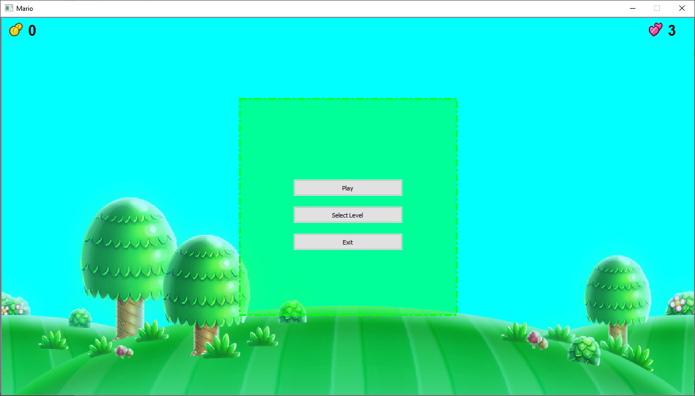
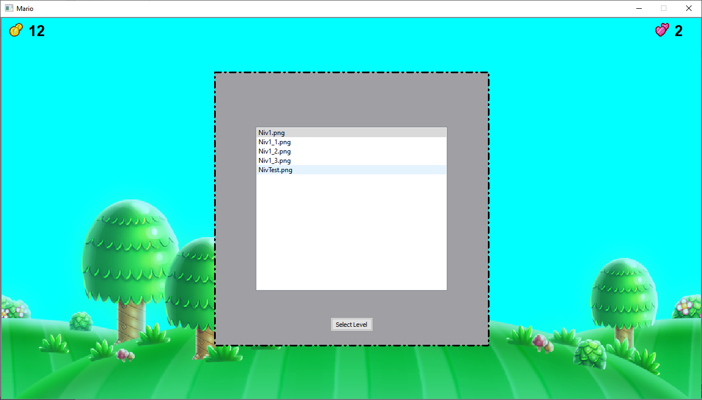
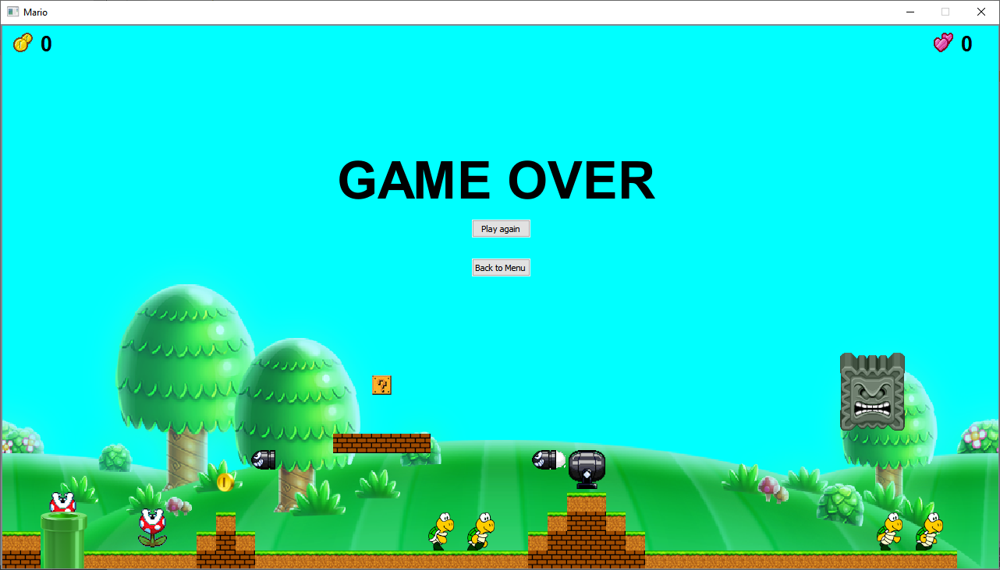
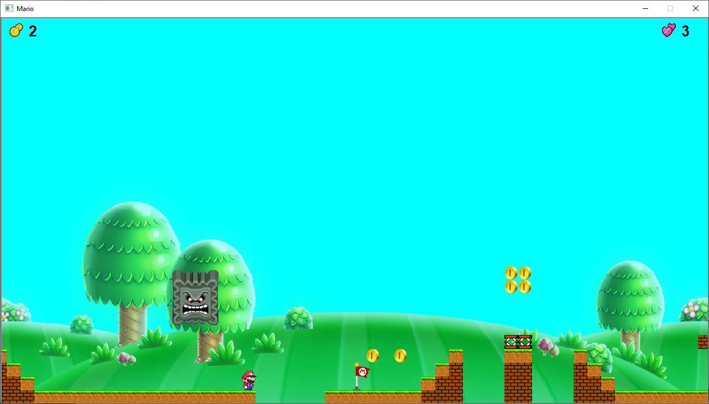
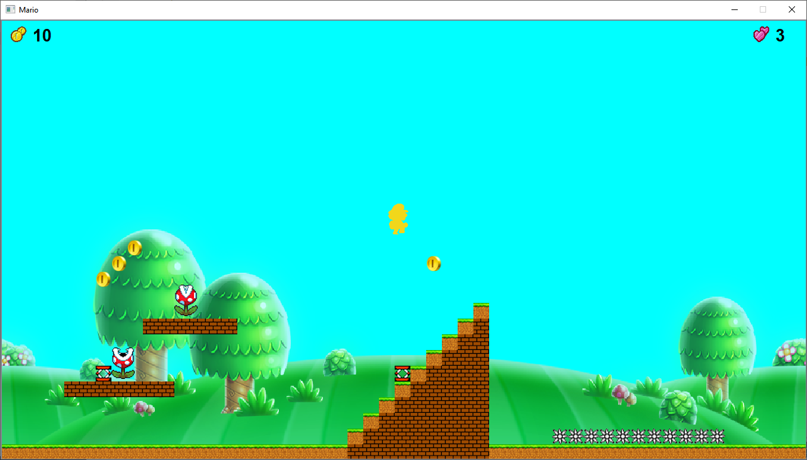

# JeuQt

## Qu'est-ce que c'est ?

Ce logiciel s'inscrit dans la réalisation du projet DI4 de C++ QT. Il a été réalisé par Yoann DUPAS, Léo PINOT, Pierre SAVARY et Adrien VERDIER.

Le but était de mettre en place un jeu platformer type Mario en langage C++.

## Installation

Le projet étant un projet QT, il est donc cross-platform. Nous recommandons l'installation de QTCreator pour la compilation du projet (Fichier -> "ouvrir un fichier ou projet" et sélectionner le Mario.Pro).

## Editeur de niveau

Pour éditer des niveaux, il suffit de simplement d'ouvrir une grille avec paint et de remplir les cases avec les couleurs correspondant au élément disponible dans le fichier level.cpp. La grille se trouve dans dans le fichier suivant Mario/images/Niveau/Grille.png

##Screenshot

- Menu

- Selection du niveau

- Niveau 1

- GameOver

- Checkpoint

- Etoile

- Bowser

- Fin du niveau

- Editeur de niveau

